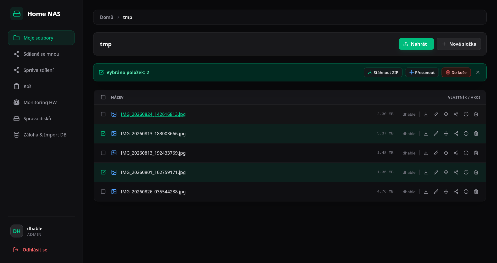
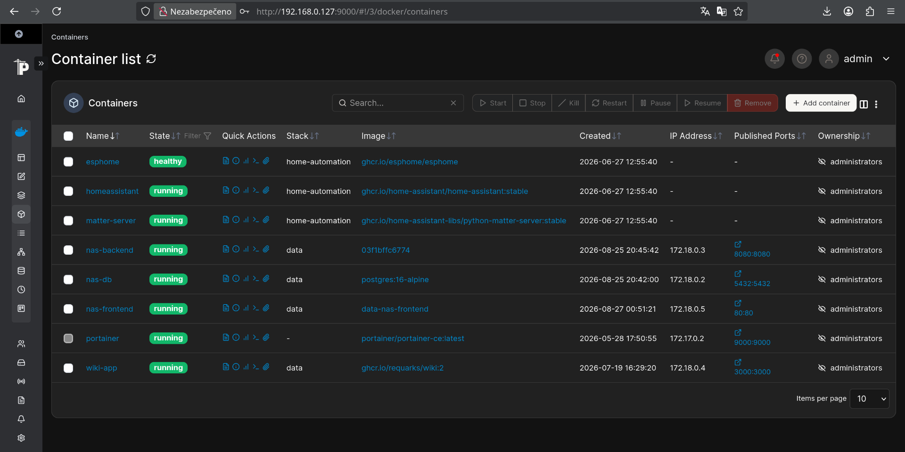

# Home NAS System

A full-stack, web-based Personal Network Attached Storage (NAS) application built 
with **Spring Boot**, **React**, **PostgreSQL**, and **Nginx**, 
fully containerized using **Docker Compose**.



## Live Server Infrastructure

The application is deployed on a dedicated **Debian Linux** home server running **Portainer** for container management:



---

## Features

### File & Folder Management
* **Upload & Multi-Upload:** Upload single or multiple files simultaneously.
* **Directory Navigation & Operations:** Create folders, rename, and move files and folders.
* **Bulk Operations:** Select multiple items to batch-move, move to trash, or download as a consolidated **ZIP archive**.
* **Media Streaming:** Stream audio and video directly in the browser via HTTP Range requests (`206 Partial Content`).
* **Recycle Bin (Soft Delete):** Safely move items to trash, restore them anytime, or permanently delete them from physical storage.

### Sharing & Access Control
* **Resource Sharing:** Share files and folders with specific registered users.
* **Granular Permissions:** Assign read/write access permissions per resource.
* **Sharing Dashboards:** View items "Shared with me", manage items "I share", and revoke access instantly.

### Security & Authentication
* **Session Management:** Stateful session authentication powered by Spring Security (`JSESSIONID`).
* **First-Time Setup:** Automatic system initialization check (`init-status`) when no user exists in the database.
* **Role-Based Access Control:** Role separation between standard users and administrators (`ADMIN`).

### Hardware & Database Administration (`ROLE_ADMIN`)
* **Hardware Monitoring:** Live CPU, RAM, and Disk space utilization metrics.
* **Storage Root Management:** Mount external host drives (e.g., `/mnt`), activate/deactivate storage locations for recording.
* **Database Backup & Restore:** Export select database tables into JSON backup files and restore system state via JSON import.

---

## Tech Stack

* **Backend:** Java 21+, Spring Boot, Spring Security, Spring Data JPA
* **Frontend:** React, Tailwind CSS, Lucide Icons
* **Database:** PostgreSQL 16
* **Web Server & Reverse Proxy:** Nginx (Alpine)
* **Containerization:** Docker & Docker Compose

---

## Architecture & Network Topology

The application runs in isolated containers managed by Docker Compose on a dedicated bridge network (`docker-home-network`):

1. **`nas-frontend` (Nginx + React SPA)**
   * Serves static React build assets on port `80`.
   * Reverse-proxies `/api/*` traffic to the Spring Boot backend container.
   * Configured with a `10G` maximum client body size and extended timeouts (`3600s`) for large file transfers and streaming.
2. **`nas-backend` (Spring Boot REST API)**
   * Runs on internal port `8080`.
   * Accesses mounted host storage paths (e.g., `/mnt`, `./nas_data`) for persistent file operations.
3. **`postgre-db` (PostgreSQL 16)**
   * Runs on internal port `5432` with volume persistence (`./postgres_data`).

---

## API Reference Overview

| Module | Method & Endpoint | Description | Access |
|---|---|---|---|
| **Auth** | `POST /api/auth/login` | Authenticate user & start session | Public |
| | `POST /api/auth/logout` | Terminate active session | Authenticated |
| | `POST /api/auth/register` | Register new user account | Public |
| | `GET /api/auth/me` | Fetch current session user profile | Authenticated |
| | `GET /api/auth/init-status` | Check if initial system setup is needed | Public |
| **Storage** | `GET /api/nas/content` | Fetch folder contents (files & subfolders) | Authenticated |
| | `POST /api/nas/files/upload` | Upload single file | Authenticated |
| | `POST /api/nas/files/upload/multi` | Upload multiple files | Authenticated |
| | `GET /api/nas/files/download/{id}` | Download single file | Authenticated |
| | `POST /api/nas/files/download-zip` | Download selected files as ZIP | Authenticated |
| | `GET /api/nas/files/stream/{id}` | Stream media via HTTP Range requests | Authenticated |
| | `DELETE /api/nas/files/{id}/trash` | Move file to recycle bin | Authenticated |
| | `POST /api/nas/files/{id}/restore` | Restore file from trash | Authenticated |
| | `DELETE /api/nas/files/{id}` | Permanently delete file from disk | Authenticated |
| **Sharing** | `POST /api/nas/share` | Grant/update resource sharing permissions | Authenticated |
| | `GET /api/nas/share/i-share` | List items shared by current user | Authenticated |
| | `GET /api/nas/share/shared-with-me`| List items shared with current user | Authenticated |
| | `DELETE /api/nas/share/{id}` | Revoke sharing permission | Authenticated |
| **Admin** | `GET /api/admin/monitoring/stats` | Retrieve CPU, RAM & Disk stats | Admin |
| | `GET /api/admin/disks` | List storage drives / root locations | Admin |
| | `POST /api/admin/disks/{id}/activate`| Enable drive for recording | Admin |
| | `POST /api/nas/database/export` | Export database backup to JSON | Admin |
| | `POST /api/nas/database/import` | Restore database state from JSON | Admin |

---

## Getting Started

### Prerequisites

* [Docker](https://docs.docker.com/get-docker/) & [Docker Compose](https://docs.docker.com/compose/) installed on host OS.

### Installation & Execution

1. **Clone the repository:**
```bash
git clone https://github.com/DennisHable/java_nas.git
cd java_nas
```

2. **Configure Database Credentials:**
Update database user and password placeholders inside `docker-compose.yml`:
```yaml
POSTGRES_USER: your_username
POSTGRES_PASSWORD: your_password
```

3. **Build & Start Containers:**
```bash
docker-compose up -d --build
```

4. **Access the Application:**
Open your browser and navigate to:
[NAS](http://localhost:5173/)

---

## Key Configuration Details

* **File Upload Limit:** Nginx is pre-configured (`client_max_body_size 10G;`) to support large file uploads up to 10 Gigabytes.
* **Session Persistence:** Essential proxy headers (`Host`, `X-Real-IP`, `X-Forwarded-For`, `X-Forwarded-Proto`) are passed in Nginx to maintain `JSESSIONID` authentication context.
* **Storage Mounts:** External drives mounted under `/mnt` on the host system are mapped directly into the backend container for multi-disk storage management.
